
# Neutrino Oscillations

## Introduction

Neutrinos are fermionic particles first theorized by Wolfgang Pauli and later discovered in the Cowan–Reines neutrino experiment. They belong to the neutral lepton family, which makes it incredibly difficult to detect (because they only interact via the weak force) even though they are the most abundant subatomic particle in the universe. Three flovors of neutrinos were predicted by the standard model, electron, muon and tau neutrinos. The electron neutrino was discovered by Reines and Cowan by observing electron antineutrinos released from a nuclear reactor in South Carolina, 26 years after Pauli’s hypothesis. The second kind of neutrino, muon neutrino, was discovered by Lederman, Schwartz and Steinberger in 1962 with the first accelerator neutrino beam at Brookhaven National Laboratory. The tau neutrino was only discovered in 2000 in the Fermi laboratory.

The idea of neutrino oscillation first put forward by Pontecorvo in 1957, proposed that neutrino-antineutrino transition may occur in analogy with the neutral kaon mixing. Later Pontecorvo, Maki, Nakagawa and Sakata speculated that neutrino could change
flavor while in flight, called “neutrino oscillation”, if neutrinos have mass and mixing exists between flavor and mass eigenstates. In 1960 Raymond Davis observed a deficit in the electron neutrino produced in the nuclear fusion in sun from the value predicted by the standard solar model. This could only have been possible if neutrinos changed flavors as the travel to the earth. Later other experiments showed that the deficit was 70% from the predicted value.

This shortfall of solar neutrinos was explained by experiments led by this year’s laure-ates, Arthur McDonald of Queen’s University in Kingston, Canada, and Takaaki Kajita of the University of Tokyo. The work revealed that the three flavors of neutrino can
interconvert as the particles stream through space.

## PMNS Theory
Bruno Pontecorvo speculated that if neutrinos have mass, then mixing exists between the flovor and mass eigenstates. Later the specific mechanism involving the mixing matrix was formalized by Maki, Nakagawa, and Sakata, now called the PMNS (Pontecorvo-Maki- Nakagawa-Sakata) theory. It states that each of the neutrino flavor basis ( electron, muon and tau neutrinos) can be written as a superposition of three mass eigenstates (m1,m2 and m3). The transformation from neutrino mass basis to flavor basis is achieved by the PMNS matrix.

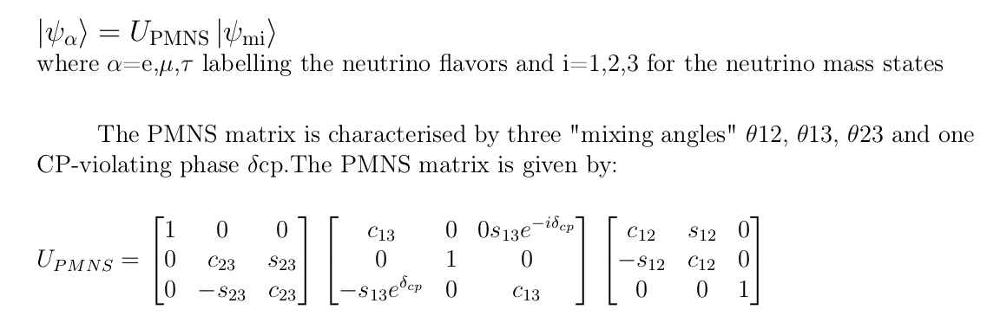
 

## Why Quantum Simulation ?

The idea of quantum simulations is the use of quantum systems to simulate other quantum systems in programmable fashion. It is impossible to truly simulate a quantum mechanical event using a classical universal device. According to the lecture by Feyman in 1981, the only way to simulate events in nature is by using a system that is quantum mechanical.Oscillating neutrino beams exhibit quantum coherence over distances of thousands of kilometers. Precise measurements of parameters in the PMNS framework might lead to new physics beyond the Standard Model. However it is very difficult to determine these in the experiments. Quantum simulation are the best alternatives to study this phenomenology. Thus if we could encode the state of neutrinos in some n qubit hilbert space and find unitary gates to evolve the quantum state, we could simulate neutrino oscillation on a quantum computer. However with the present level of technology quantum simulations are noisy. Thus noise reducing algorithms are also implemented to get accurate results.

## Numerical Simulation 

__Code: Neutrino_osc.py__

The graphs below show the _flavor state probability_ as a function of _L/E_,(where L is the distance travelled and E is the evergy),for each of the initial flavor state.

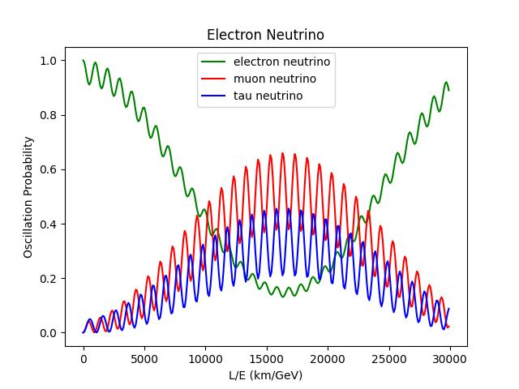
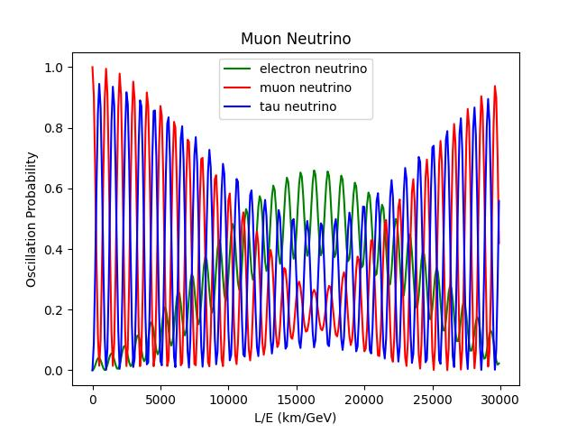

## Matter Interaction
__Code: Matter_Inter.py__
  
The graphs below show the _flavor state probability_ as a function of _L/E_,for an initial muon flavor state, in the presence of matter interaction. The interaction potential values used are $V=0, 10^{-3}, 10^{-5}$

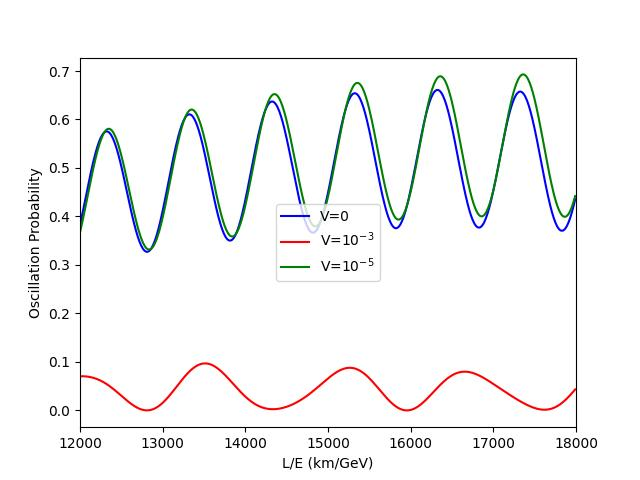
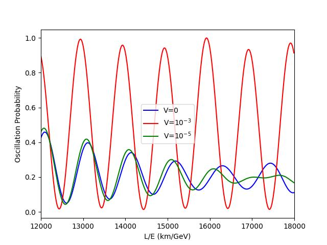
## Quantum Simulations

In order to do quantum simulations of neutrino oscillations, the system needs to be represented in a two-qubit hilbert space. Each of the orthogonal states |0, 0⟩ , |0, 1⟩ , |1, 0⟩ represents the three neutrino flavors - electron, muon, tau respectively. The forth state |1, 1⟩ is taken to be a sterile neutrino (Sterile neutrinos are hypothetical particles that are believed to interact only via gravity and not via any of the other fundamental interactions of the Standard Model) that is considered decoupled to the other three states.

### Building the Quantum Circuit

To make the quantum circuit, the PMNS matrix needs to be written in terms of the basic quantum gates such as the controlled-u rotation gates, C-NOT gate and the Pauli X gate.

The controlled-u rotation gate when the target qubit is the LSB(Least significant bit):

## IBM Qiskit

IBM has developed some of the most advanced quantum computers in the world. Moreover they have given free cloud access to their quantum computers through Qiskit framework. Qiskit is an open-source software development kit for working with quantum computers
at the level of circuits, pulses, and algorithms and running them on prototype quantum devices on IBM Quantum Experience or on simulators on a local computer. The primary version of Qiskit uses Python programming language and is well supported on the Jupyter Notebook environment.

### QasmSimulator

__Code: Qasm_sim.ipynb__
    
The QasmSimulator backend is designed to mimic an actual IBM quantum computer. The quantum measurements in a real IBM quantum computer has a lot of noise in the result. But the QasmSimulator can simulate quantum circuits both ideally and subject to noise modeling. The circuit was run in the QasmSimulator to verify the circuit and compare it with the numerical simulations. The code "Qasm_sim.ipynb" gives the simulations in QasmSimulator.

The following results were obtained.

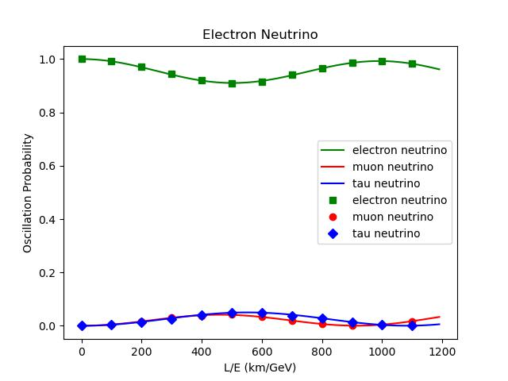
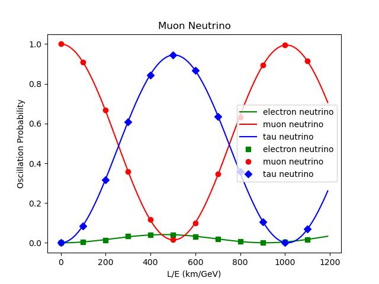
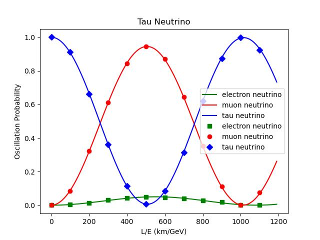

The QasmSimulator measurements matches exactly with the theoritical results. This proves that the quantum circuit built is accurate.

### Real Quantum Simulations

__Code: IBM_sim_electron.ipynb, IBM_sim_muon.ipynb, IBM_sim_tau.ipynb__

The quantum circuit was run on the "ibmq-manila" backend. The results obtained had a lot of noise which made the measurements deviate from thetheoritical results. Thus the "CompleteMeasFitter" and "complete-meas-cal" functions were imported from the qiskit.ignis.mitigation package. This reduced the error by significant amount. The following results were obtained from the real quantum computer simulations.

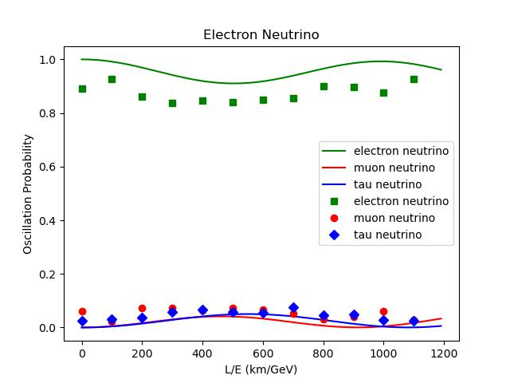
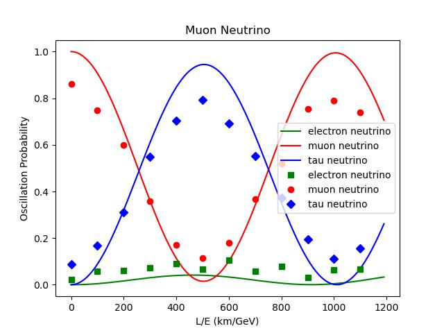
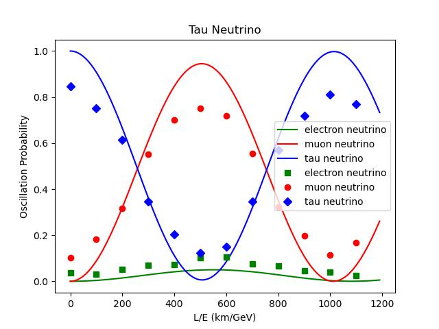

## References

[1] Ioannisian, A. and Pokorski, S. (2018) ‘Three neutrino oscillations in matter’, Physics Letters B, 782, pp. 641–645. doi:10.1016/j.physletb.2018.06.001.

[2] Freund, M. (2001) ‘Analytic approximations for three neutrino oscillation parameters and probabilities in matter’, Physical Review D, 64(5). doi:10.1103/physrevd.64.053003.

[3] Giganti, C., Lavignac, S. and Zito, M. (2018) ‘Neutrino oscillations: The rise of the pmns paradigm’, Progress in Particle and Nuclear Physics, 98, pp. 1–54. doi:10.1016/j.ppnp.2017.10.001

[4] Argüelles, C.A. and Jones, B.J. (2019) ‘Neutrino oscillations in a quantum processor’,Physical Review Research, 1(3). doi:10.1103/physrevresearch.1.033176.

[5] Molewski, M.J. and Jones, B.J.P. (2022) ‘Scalable qubit representations of neutrino

mixing matrices’, Physical Review D, 105(5). doi:10.1103/physrevd.105.056024.

[6] Nguyen, H.C. et al. (2023) ‘Simulating neutrino oscillations on a superconducting

qutrit’, Physical Review D, 108(2). doi:10.1103/physrevd.108.023013.

[7] Nielsen, M.A. and Chuang, I.L. (2022) Quantum Computation and Quantum Information. Cambridge: Cambridge University Press.

[8] Oliveira, I.S. (2007) NMR Quantum Information Processing. Amsterdam: Elsevier.23

