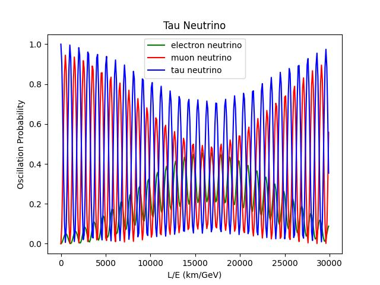

# Neutrino Oscillations

## Project Description

This project aims at quantum simulation of the `Three Flavour Neutrino Oscillations` using `PMNS Theory`, for both vacuum and matter interaction, as well as with and without CP violation on a subspace of a two-qubit Hilbert space. The following work is presented is this project.

1. Python codes for numerical simulation of PMNS theory.
2. Building quantum-circuits using the `Qiskit` framework (The primary version of Qiskit uses Python programming language and is well supported on the Jupyter Notebook environment).
3. Simulating the quantum circuits on the `QasmSimulator`, a tool developed by IBM to emulate the behavior of their actual quantum computers.
4. Simulating quantum circuits on `IBM's quantum computers` through cloud access.

For more information on Neutrino-Oscillation and PMNS theory, refer [Project report](Project_report.pdf)
 
## Numerical Simulation 

__Code__: [Neutrino_osc.py](Neutrino_osc.py)

The code gives the graphs of the _flavor state probability_ as a function of _L/E_,(where L is the distance travelled and E is the evergy),for each of the initial flavor state.




### Matter Interaction

__Code__: [Matter_Inter.py](Matter_Inter.py)
  
The code gives the graphs of the _flavor state probability_ as a function of _L/E_,for an initial muon flavor state, in the presence of matter interaction. The interaction potential values used are $V=0, 10^{-3}, 10^{-5}$


## Quantum Simulations

In order to do quantum simulations of neutrino oscillations, the system needs to be represented in a two-qubit hilbert space. Each of the orthogonal states |0, 0⟩ , |0, 1⟩ , |1, 0⟩ represents the three neutrino flavors - electron, muon, tau respectively. The forth state |1, 1⟩ is taken to be a sterile neutrino (Sterile neutrinos are hypothetical particles that are believed to interact only via gravity and not via any of the other fundamental interactions of the Standard Model) that is considered decoupled to the other three states.

### Building the Quantum Circuit

To make the quantum circuit, the PMNS matrix needs to be written in terms of the basic quantum gates such as the controlled-u rotation gates, C-NOT gate and the Pauli X gate.

The controlled-u rotation gate when the target qubit is the LSB(Least significant bit):


## IBM Qiskit

IBM has developed some of the most advanced quantum computers in the world. Moreover they have given free cloud access to their quantum computers through Qiskit framework. Qiskit is an open-source software development kit for working with quantum computers
at the level of circuits, pulses, and algorithms and running them on prototype quantum devices on IBM Quantum Experience or on simulators on a local computer. The primary version of Qiskit uses Python programming language and is well supported on the Jupyter Notebook environment. To install Qiskit package in Jupyter Notebook, run:

```python
!pip install qiskit
```
### QasmSimulator
    
The QasmSimulator backend is designed to mimic an actual IBM quantum computer. The quantum measurements in a real IBM quantum computer has a lot of noise in the result. But the QasmSimulator can simulate quantum circuits both ideally and subject to noise modeling. To use the QasmSimulator, run the code:

```python
from qiskit import Aer
# Initialize the QasmSimulator
simulator = Aer.get_backend('qasm_simulator')
```
The circuit was run in the QasmSimulator to verify it and compare it with the numerical simulations. The following results were obtained, showing the _flavor state probability_ as a function of _L/E_.

__Code__: [Qasm_sim.ipynb](Qasm_sim.ipynb)


The QasmSimulator measurements matches exactly with the theoritical results. This proves that the quantum circuit built is accurate.

### Real Quantum Simulations

To use an IBM quantum computer run the following code.

```python
from qiskit import IBMQ
```
```python
IBMQ.load_account()
```
```python
provider = IBMQ.get_provider(hub='ibm-q', group='open', project='main')
```
To find all the backends, use the code:
```python
provider.backends()
```
To check the status of the backend run:
```python
#Here we are checking the status of 'ibmq_manila' backend
status('ibmq_manila').to_dict()
```
Find a backend with less pending jobs and to use the backend run:
```python
qcomp = provider.get_backend('ibmq_lima')
```
The results obtained had a lot of noise which made the measurements deviate from the theoritical results. Thus the "CompleteMeasFitter" and "complete-meas-cal" functions were imported from the qiskit.ignis.mitigation package. This reduced the error by significant amount. 
```python
from qiskit.ignis.mitigation.measurement import (CompleteMeasFitter,complete_meas_cal)
```
The following results were obtained from the real quantum computer simulations after error mitigations.

__Code__: [IBM_sim_electron.ipynb](IBM_sim_electron.ipynb), [IBM_sim_muon.ipynb](IBM_sim_muon.ipynb), [IBM_sim_tau.ipynb](IBM_sim_tau.ipynb)


